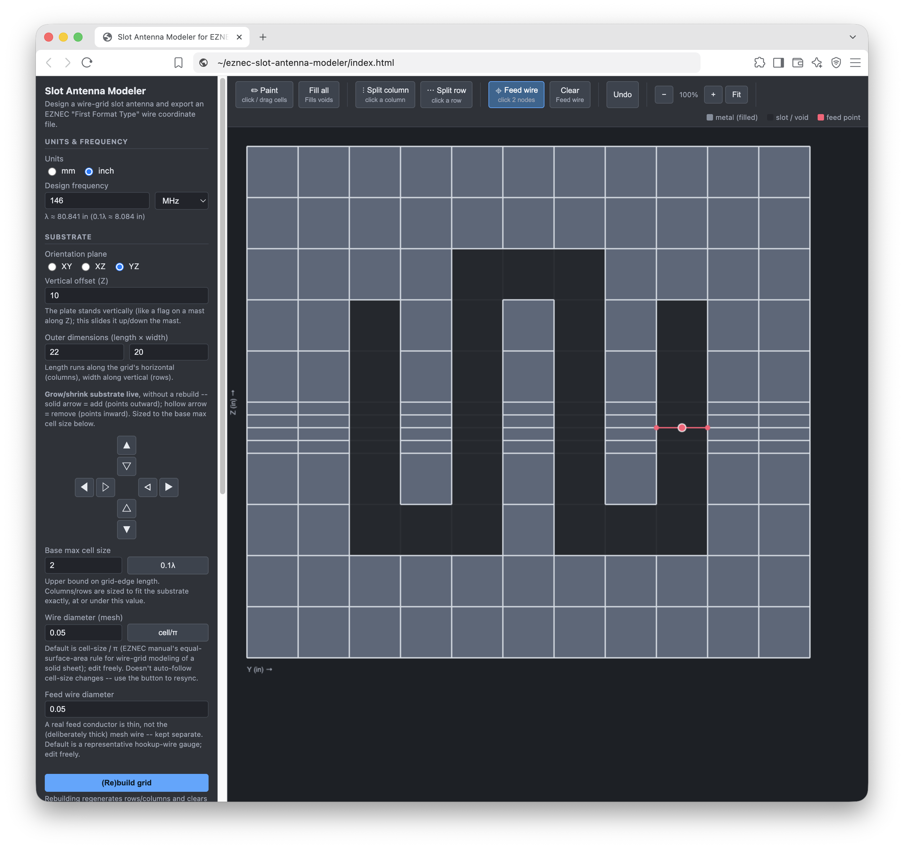
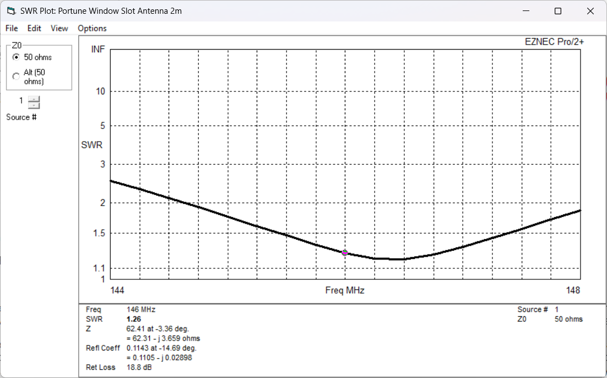

# EZNEC Slot Antenna Modeler

A single-page, no-install web tool for designing wire-grid slot antennas
and exporting them as an EZNEC-compatible wire coordinate file.

It's aimed at slot antennas: paint a slot (straight, S-fold, or W-fold) into a
solid metal plate on a canvas, and the tool builds the equivalent NEC wire-grid
mesh, respects EZNEC Pro+'s geometry rules (wires connect only at endpoints,
no crossings) by construction, and exports a file you can import directly.

This is an independent, unofficial tool. It is not affiliated with or endorsed
by EZNEC Software / Roy Lewallen, W7EL.

## Getting started

No install, no build step, no server required. Just open `index.html` in any
modern desktop browser (Chrome, Edge, Firefox, Safari) — double-click it, or
drag it into a browser window.

## Usage

### 1. Units & Frequency

- Choose **mm** or **inch**.
- Enter your **design frequency**. This computes &lambda; and a suggested
  maximum grid-edge length (0.1&lambda;, per EZNEC's own wire-grid modeling
  guidance).

### 2. Substrate

- **Orientation plane** — which plane the plate lies in (XY, XZ, or YZ).
- **Vertical offset (Z)** — always shifts the model's Z coordinate. For an XY
  (horizontal) plate this sets height above a ground plane at Z=0; for an XZ
  or YZ (vertical) plate it slides the whole plate up/down like a flag on a
  mast.
- **Outer dimensions** — the plate's overall length x width.
- **Base max cell size** — upper bound on grid-edge length; the "0.1&lambda;"
  button fills in the suggested value. Rows/columns are sized to fit the
  substrate exactly, at or under this value.
- **Wire diameter (mesh)** — diameter of the wire-grid mesh wires. Defaults to
  `cell size / pi`, EZNEC's documented equal-surface-area rule for modeling a
  solid sheet as a wire grid (see the EZNEC manual, "Wire Grid Creation").
- **Feed wire diameter** — diameter of the feed wire only, kept independent
  of the (deliberately thick) mesh diameter. Defaults to a representative
  real hookup-wire gauge.
- **(Re)build grid** — regenerates the grid from the settings above. This is
  destructive: it clears any painting, refinement, and the feed wire.

### 3. Editing the grid

Toolbar tools (top of the canvas):

- **Paint** — click or drag cells to toggle them between metal (filled) and
  slot/void. This is how you carve a slot, including folded (S/W-style)
  shapes.
- **Split column / Split row** — click a column or row to subdivide it into
  two, for locally refining the mesh near slot ends and corners without
  affecting the rest of the grid. Splitting keeps every grid line spanning
  the full sheet, so wires can only ever meet at shared endpoints — this is
  what keeps the exported geometry NEC/EZNEC-Pro+-safe even with a
  non-uniform grid.
- **Feed wire** — click two grid nodes across the slot to insert a feed wire
  between them. It's exported as a real 1-segment wire so that an EZNEC
  source placed at 50% (its center) — the point marked in red — lands
  exactly at the wire's midpoint. The feed wire is always exported as
  wire #1, so a source defined as "wire 1, 50%" in EZNEC keeps working as
  you iterate on the slot shape.
- **Clear feed** — removes the feed wire.
- **Fill all** — resets every cell to filled (undoes all voids).
- **Undo** — steps back through paint/split/feed/grow-shrink edits.
- **Zoom** — `-` / `+` / `Fit` buttons, or scroll the mouse wheel over the
  canvas (zooms centered on the cursor).
- **Column/row edge groups** (`+`/`-` with arrows) — grow or shrink the
  substrate by one row/column at a given edge, sized to the current base max
  cell size. Unlike (Re)build grid, this is a live edit that doesn't reset
  your design.

### 4. Slot Guidance

Live stats on the current void, updated as you edit:

- Suggested slot length (&asymp;0.5&lambda;) and width
  (&asymp;0.01&lambda;&ndash;0.06&lambda;) for your design frequency.
- **Measured slot length** — the void's true centerline length, end to end,
  correctly following any S/W-fold bends rather than cutting corners.
- **Effective length / cross-width** — the nominal centerline dimensions
  minus the mesh wire diameter, i.e. the slot's true electrical opening once
  wire thickness is accounted for. A warning appears if the wire diameter
  would pinch the slot shut.

### 5. Export

**Download wire coordinate file (.txt)** writes an EZNEC "First Format Type"
wire coordinate file (see the EZNEC manual's Wire Coordinate File section),
with CRLF line endings (required — EZNEC only runs on Windows and its ASCII
importer expects native line endings). A live preview is shown in the
sidebar.

To use it: in EZNEC, **File &rarr; Import Wire Coordinates from ASCII
File**. The file contains wires only — frequency, ground, and (if you didn't
place a feed wire in the tool) the source still need to be set up manually
in EZNEC afterward.

## Known limitations

- **Non-uniform grid vs. wire diameter**: locally refining the grid (Split
  row/column) can shrink spacing below the mesh wire diameter, which EZNEC's
  Geometry Check will flag as overlapping wires. If you hit this, use a
  smaller wire diameter, refine less aggressively, or use a more uniform
  cell size in the refined area.
- **Effective-dimension compensation is analytical only**: the "effective"
  length/width stat tells you how much the wire's thickness eats into the
  nominal slot opening, but doesn't (yet) move wire geometry to compensate.
  If your design needs the *exact* nominal dimension as the true electrical
  opening, inflate the painted void by the reported difference.
- **Matching networks aren't modeled**: many real slot antennas (e.g. the
  classic aluminum-tape "tune"/"match" shorting-strap designs) rely on a
  feed point placed asymmetrically near a shorted end to transform
  impedance. This tool exports the wire mesh and an optional feed wire at a
  location you choose — it's on you to place that feed correctly for the
  matching technique you're using, and to model any shorting structure as
  additional void/fill painting.
- Tested primarily on desktop Chromium-based browsers; should work on any
  modern browser but hasn't been extensively tested elsewhere.

## Worked example

[Portune's Aluminum-Tape Staggered Window Glass Slot (2m)](examples/portune-window-slot-2m/) —
a full before/after case study: modeling the published dimensions directly gave SWR of
2.5-10 across the band, while widening the substrate margin and locally increasing
mesh density near the feed brought that down to 1.2-2.5. Includes every EZNEC
screenshot and the raw `.EZ`/wire-coordinate files so you can load the results
yourself.

## License

MIT — see [LICENSE](LICENSE).
