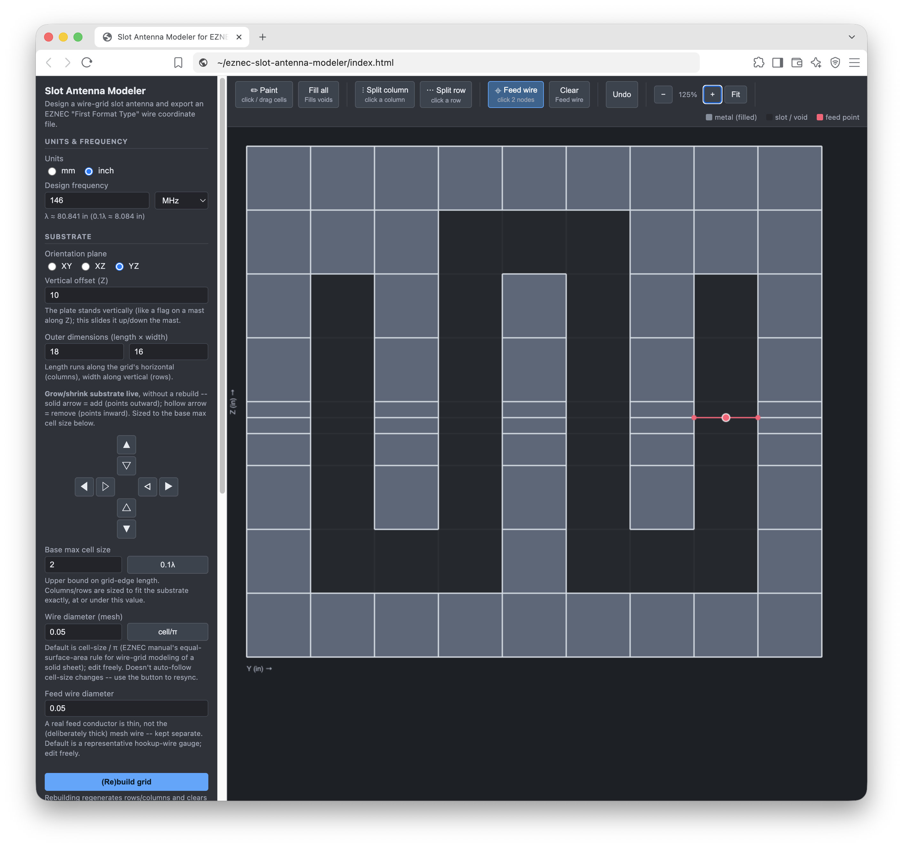
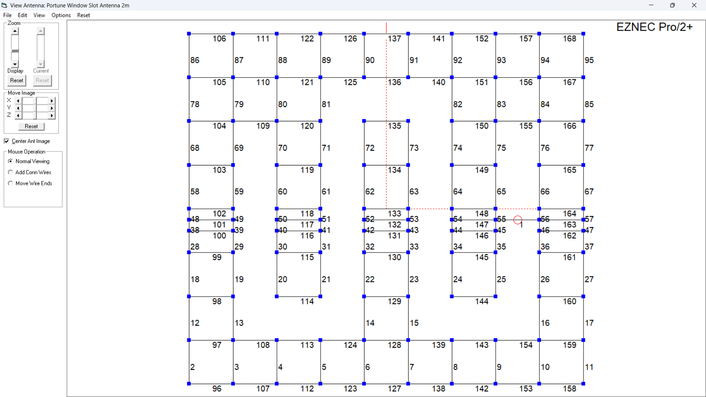
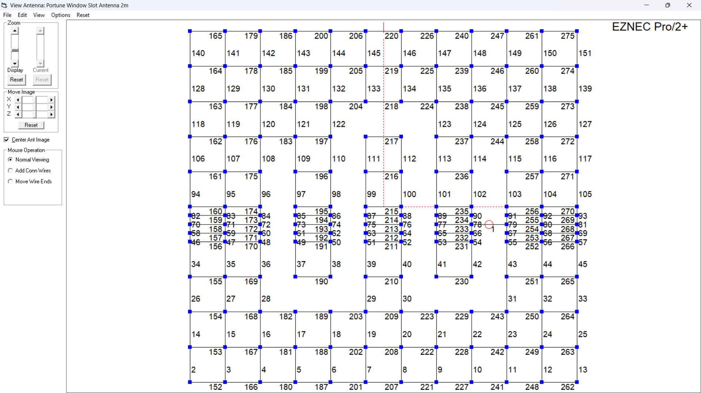
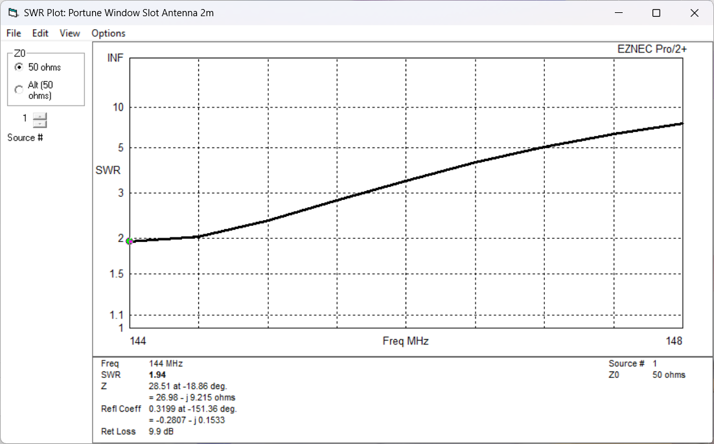
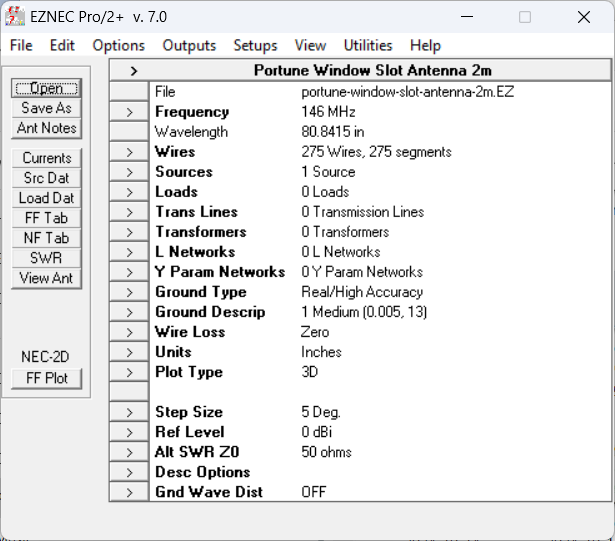
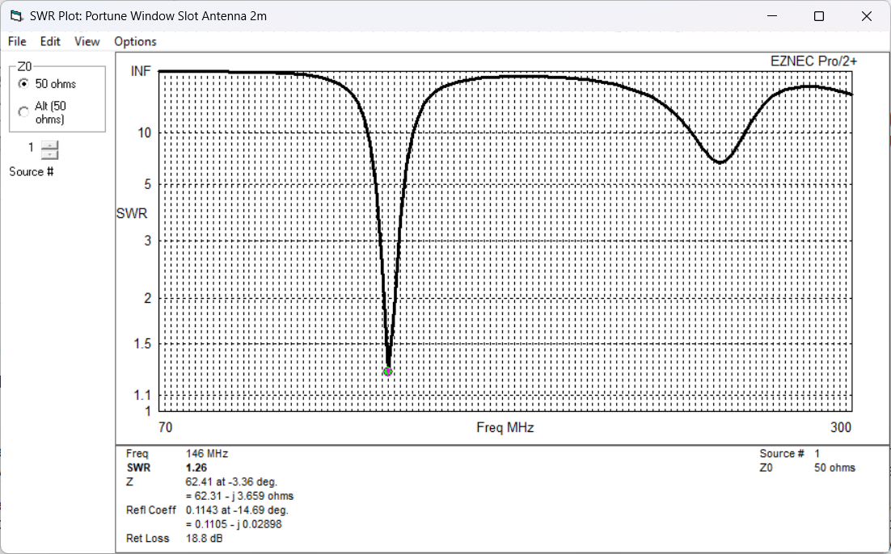
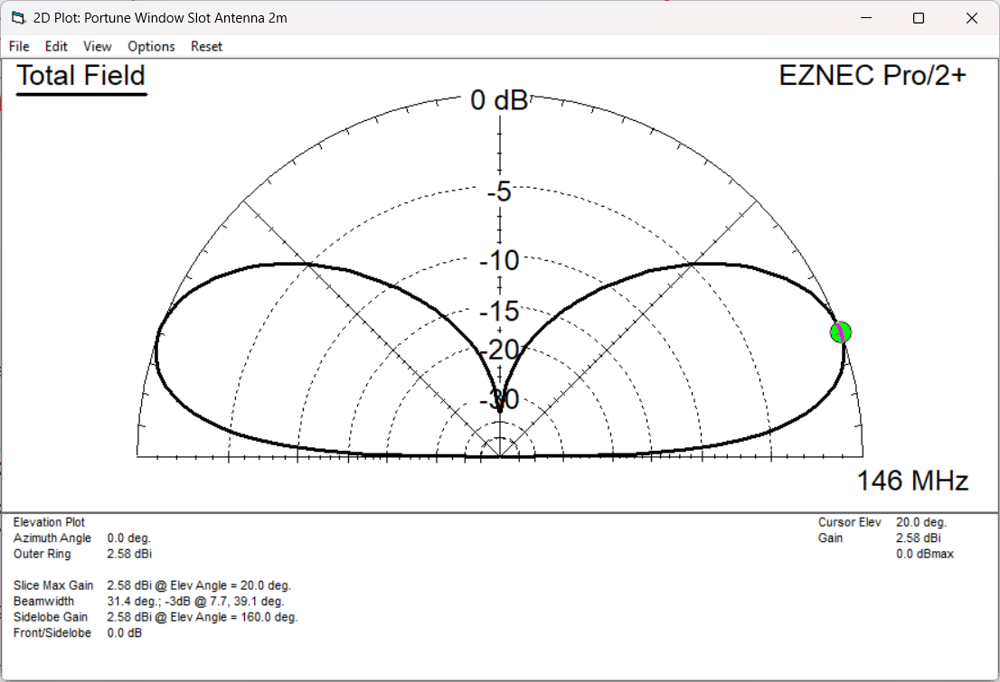
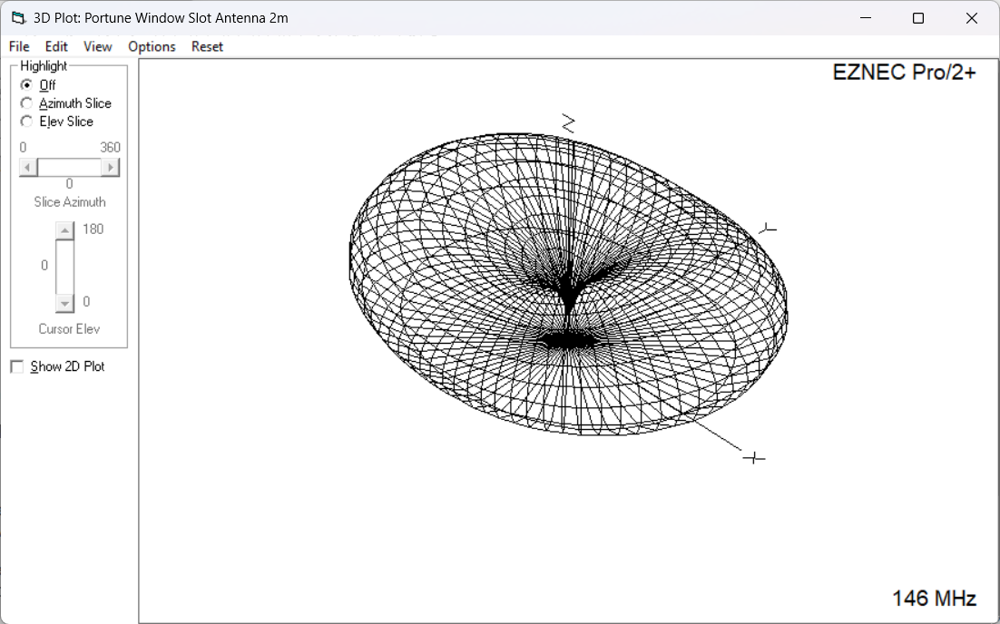

# Worked example: Portune's Aluminum-Tape Staggered Window Glass Slot (2m)

A full before/after case study of modeling a published slot antenna design with the
[EZNEC Slot Antenna Modeler](../../), including every intermediate EZNEC screenshot and
the raw model files, so you can load them yourself and check the results.

The design is Chapter 7 of *Slot Antennas for Ham Radio* by John Portune, W6NBC — an
aluminum-tape slot antenna built on a window pane, cut as a "staggered" (S-fold) slot
so it fits a rectangular window, tuned and matched for 2m (144-148MHz) with two
shorting straps near either end of the slot.

This is an independent, unofficial write-up. It is not affiliated with or endorsed by
John Portune, EZNEC Software, or Roy Lewallen, W7EL.

## What we found

Modeling Portune's *published* dimensions (18" x 16" substrate, uniform mesh) directly
gave disappointing results: minimum SWR around 2.5, rising to roughly 7-10 at the
edges of the 144-148MHz design band.

Two changes, discovered by experimentation rather than predicted in advance, fixed it:

1. **Widened the substrate border by 2" all around** (18x16" &rarr; 22x20"), giving the
   wire-grid mesh more margin around the slot before it hits the plate edge.
2. **Increased mesh row density on either side of the feed point** -- several extra
   horizontally-arranged wire subdivisions immediately above and below where the feed
   wire crosses the slot.

With both changes, calculated SWR holds between 1.2 and 2.5 across the full
144-148MHz band, centered on 1.2 at 146MHz.

**Neither change is predicted by Portune's original (real-world, tune-by-analyzer)
construction article.** They're specific to getting an accurate *wire-grid mesh model*
of the design in EZNEC -- see [Known limitations](../../README.md#known-limitations)
in the main README for why mesh density and substrate margin matter this much.

A third finding, unrelated to the mesh itself: switching the EZNEC ground model from
**Free Space** to **Real/High Accuracy** moved the calculated minimum SWR from 1.1 to
1.2. Worth remembering even for an antenna you'd intuitively model as "just in free
space" -- ground modeling choice measurably affects the result.

## Original vs. modified, side by side

| | Original (18x16") | Modified (22x20") |
|---|---|---|
| Substrate & mesh |  |  |
| EZNEC wire/segment view |  |  |
| SWR, 144-148MHz |  |  |

That SWR pair is the whole story in two pictures: same band, same 50&Omega; reference,
same plot scale -- just the mesh and margin changed.

## Supporting plots

Model definition summary (frequency, ground type, segment count, etc.):

Wider sweep (70-300MHz) for the modified design, showing the antenna is well-behaved
outside the immediate design band too:

Radiation pattern (modified design, 146MHz) -- the expected omnidirectional,
vertically-polarized donut, consistent with Portune's own description of the antenna
family ("gain equal to a J-pole"):

## Files

Load these directly in EZNEC to reproduce the results above:

- [`model-modified.EZ`](model-modified.EZ) -- full EZNEC project (frequency, ground,
  source, wires) for the 22x20" modified design.
- [`model-original.EZ`](model-original.EZ) -- same, for the original 18x16" dimensions.
- [`wires-modified.txt`](wires-modified.txt) -- the wire-coordinate ASCII file exported
  directly from the Slot Antenna Modeler for the modified design (wires only, per the
  format's design -- frequency/ground/source are already set up in the `.EZ` files
  above if you just want to explore, or re-import this into a fresh EZNEC description
  to see the raw tool output).

## Source

- *Slot Antennas for Ham Radio*, Chapter 7: "Aluminum-Tape Staggered Window Glass
  Slot," by John Portune, W6NBC.
- Inspired by [this YouTube video](https://www.youtube.com/watch?v=skwCZjFP8a8) on
  slot antennas for ham radio.
